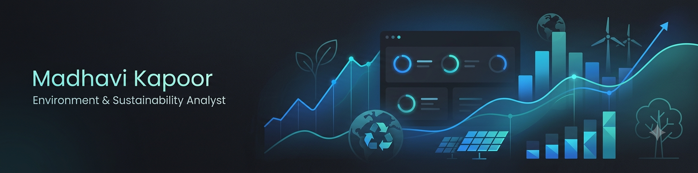

# Hi, I'm Madhavi Kapoor 

---

##  About Me

I'm an Economics student (with a Computer Science minor) at the University of Delhi, and I'm building the data skills to work on **environment and sustainability research and analysis**. My background gave me strong foundations in research design, quantitative reasoning, and academic writing — now I'm adding Python, SQL, and Power BI to turn that research mindset into data-driven insight. I'm especially interested in how data analytics can support evidence-based decisions on sustainability and public policy.

---

##  Currently Learning

- 🐍 Python  
- 🗄️ SQL  
- 📊 Power BI  
- 📈 Statistics  
- 📉 Data Visualisation  

---

##  Tools & Tech

**Data Analysis:** Python · SQL · Excel · STATA  
**Visualization:** Power BI · Tableau · MATLAB  
**Foundations:** Statistics · Quantitative & Qualitative Research Methods  

---

##  Projects / Case Studies

### 🔹 Gender & Cultural Stereotypes in the Workplace
**Problem:** Understand how gender and cultural stereotypes affect workplace experiences and outcomes.  
**Approach:** Designed and ran a primary quantitative research study; collected and analysed responses from 100+ participants.  
**Tools used:** Survey design, statistical analysis, academic reporting.

### 🔹 Deloitte Australia Data Analytics Job Simulation (Forage)
**Problem:** Simulated forensic technology and data analysis case for a business client.  
**Approach:** Classified and cleaned data in Excel, built a Tableau dashboard, and drew business conclusions from the findings.  
**Tools used:** Excel, Tableau.

---

##  GitHub Stats

---

##  Open To

Internships and entry-level roles as an **Environment & Sustainability Analyst / Data Analyst**, where I can apply research and analytical skills to real-world sustainability challenges.

---

##  Connect With Me

